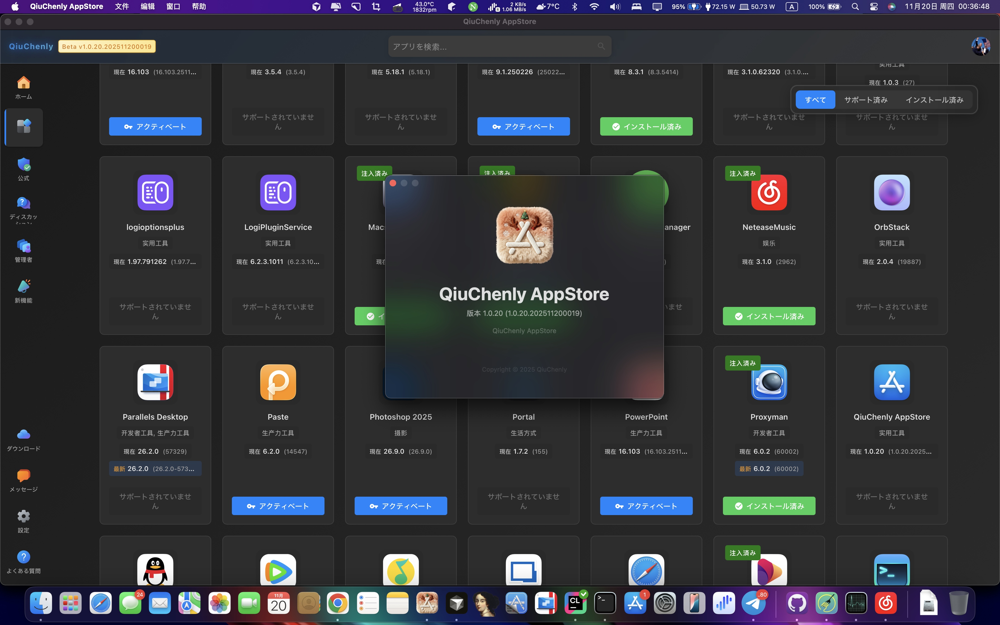

<a href="https://github.com/QiuChenly/InjectLib">

</a>

## 荣誉贡献榜
<br />
<p align="center">🔞全球各❤️地❤️服❤️务🔞<br/>
🔞①线至①⑧线城市齐全🔞<br/>
🔞汇❤️编 🚗与🤤ASM约❤️会🔞<br/>
🔞 一❤️个❤️人独自在家❤️火❤️热❤️难❤️耐 玩🔞逆🔞向 🔞<br/>
🔞找Qiu❤️Chen❤️l❤️y❤️Open❤️Source🔞<br/></p>


<a href="https://github.com/QiuChenly/CoreInject/graphs/contributors">
  
</a>

---

# 隆重推出 QiuChenly AppStore 体验测试版



接下来向各位隆重宣布，来自 QiuChenly AppStore 的全新版本。

我们封装了整个 App 和集成权限操作 Api，现在用户只需要下载 App，并简单配置一下，即可使用来自 QiuChenly 带给你的无上伟力。

商店不仅仅适用于破解，也是交流、分享所在之处。

找不到资源？没有一手消息？来 QiuChenly 公益应用商店，你可以找到任何正版和第三方正版以及志同道合的朋友进行交流、心得分享。

对于原创破解发布人员，我们提供了管理员后台，您现在可以把打包好的预破解包上传到我们的中央服务器，每一个用户都可以在 App 详情中看到您发布的最新作品。

我宣布，盗版资源站实质上已经死了。

站在你们面前的是一个全新、自由、没有限制的社区、商店、工具集合。QiuChenly 凭借数年以来持续无偿贡献的海内外良好声誉，网络资源与号召力绝非等闲资源站可堪一碰。QiuChenly 将在各位无私帮助的粉丝拥护下，继往开来，稳扎稳打，紧密围绕在 QiuChenly AppStore 周围，打造出一个令人叹为观止的庞大生态体系。

图标来自苹果应用商店，UI 设计风格来自微软应用商店。苹果看了沉默，微软看了流泪。

耗时 12 天，前后端共计 8 万 6000 多行代码，QiuChenly 为您从 0 开始构建出了整套自由软件世界的框架。

**QiuChenly，致力于人人平等的自由软件生态构建。**

**JOIN US，JOIN FREE。**

程序还在快速开发中, 请注意及时更新和关注。

所有注入库、脚本未来全部集成在App中更新,不再采取Git分发的方式。

QiuChenly 拥有不计其数的网友友情提供不限量的服务器资源、带宽，所以不必担心找不到我。

App 宣传视频: https://t.me/qiuchenlymac/1000

最新更新文件请访问最新消息获取: https://t.me/qiuchenlymac

---

## 致谢

感谢以下网友为 QiuChenly AppStore 提供的服务器资源支持：

- **部分台湾网友**：提供不限流量、无限空间的中央存储服务器
- **部分香港、中国大陆网友**：提供域名解析服务及服务器资源
- **部分中国大陆网友**：无偿自费购买并赠送给 QiuChenly 的域名服务

特别致谢：QiuChenly AppStore 的云服务、文件存储服务以及高性能弹性存储所承载的主要流量，均来自于一家高端 IDC 机房老板无偿赠送的顶级高配高带宽机器。该 IDC 承诺能够为 QiuChenly 提供最大程度的国内流量加速和企业级优选加速服务。

IDC 主机官网: https://whmcs.as211392.com/index.php?rp=/login（该 IDC 提供的机器主要面向高端客户，费用较高）

> **声明**: QiuChenly 与任何人均无任何形式的经济往来，所有致谢、介绍均出于感谢，没有任何带货、赚取广告费的目的。

---

# 旧版终端命令行使用方式

## 如何使用？

下载仓库 zip，双击运行"秋城落叶_启动.command"。

## 遇到问题？

### 方式一：查看文档

点下面的链接进入在线文档，有操作指南。

目前还没有写完，如果有没有的、看不懂的内容可以提 Issues。

**点我查看** ➡️ [使用文档](https://qiuchenlyopensource.github.io/Documentaions/)

### 方式二：获取帮助

- **Telegram 群组**: https://t.me/+VvqTr-2EFaZhYzA1
- **QQ 群**: 1049674046（拒绝翻墙从我做起）

---

# 加入社区

关注我的频道，进群获取最新的推送资讯。

- **Telegram 频道**: https://t.me/qiuchenlymac
- **Telegram 群组**: https://t.me/+VvqTr-2EFaZhYzA1
- **Twitter**: https://twitter.com/QiuChenly
- **QQ 群**: 1049674046（仅为方便国内用户反馈问题与交流，加群者请在遵守当地法律法规的前提下进行交流）

关注 QiuChenly 喵，关注落葉的 Twitter 喵。謝謝大家喵。

---

# 原神！

點擊圖片進入新世界。

[](imgs/bengbuzhule.mp4)

---

# 现已支持 IPA 注入

查看[文档](./iOSHijack/readme.md)了解更多细节。

---

# 系统要求

## 操作系统要求

- 最低运行 macOS High Sierra 10.13
- 编译 SDK macOS 14.0
- 目标部署平台 macOS 10.13

## 代码编译环境要求

### CMakeLists 环境变量

```cmake
set(CMAKE_OSX_DEPLOYMENT_TARGET "10.13")
```

### 检查二进制文件的最低 macOS 版本兼容性

```bash
find . -name "*.*" | xargs otool -l | grep -E "(minos|sdk)"
```

---

# 项目存在的目的

本项目是 Free 的、开源的、基于互联网最原始的共享精神的、不接受任何打赏的、无所不包的、令人感叹的、无与伦比的、精妙绝伦的、化腐朽为神奇的、逆天的、养生的、抽象的、二次元的、OP 的。

在 2023 年，所有人都逐渐觉得打赏、付费才是理所应当的，哪怕是某些人只做了一件从外网搬运到国内的工作，也应该得到鼓励。我不能说这种行为是完全错误的，只能说有些人恬不知耻见利忘义。哪怕是打赏也应该基于双方意愿的基础上，而不是用"打赏后才能下载"这种理由强奸用户的使用习惯，把用户变成必须付费的蠢驴，并辅以几十元的超低价注册会员费用钝刀割肉式的强奸用户。

当然，这种用户也确实是个蠢货。有这种钱你买正版得了，别跟我说太贵，你出去跟朋友吃一顿好点的饭 200 起步，大部分好软件正版才不到 100 块钱。抽包烟软中煊赫门起步，面对 19.9 年费会员时却面露难色，好像杀了你的 🐎 一样。相信我，你也并不是真的需要这些软件，只是人云亦云盲目从众罢了。

我认为，共享精神不应该建立在物质上，我深刻的理解金钱对人的吸引和动力，但这种精神本身就超越了物质。

---

# 免责声明

致来自中国大陆的各位学习研究爱好者：

根据大陆中华人民共和国《计算机软件保护条例》第十七条规定："为了学习和研究软件内含的设计思想和原理，通过安装、显示、传输或者存储软件等方式使用软件的，可以不经软件著作权人许可，不向其支付报酬。"您需知晓本仓库所有内容资源均来源于网络，仅供用户交流学习与研究使用，版权归属原版权方所有，版权争议与本仓库本作者无关，用户本人下载后不能用作商业或非法用途，需在 24 小时之内删除，否则后果均由用户承担责任。

如果你不删那就让这些喜欢发律师函的事务所一对一指导你。

我是來自北美的獨立 IOS 應用程式開發者，專注於開發有趣又富有創意的應用。對於法律問題，我只能說明技術原理，不能提供任何法律意見。希望大家都能以和平、理性的態度來探討各種課題。

同時，我也是二次元南桐。从台灣國立大學毕业的那一天，我的青春永遠留在了高雄。

對於肆意濫用法律的組織和個人，請將律師函發送至: 华盛顿特区第 35 大道林肯大街 15 号-501, John Albet 收。

---

## WHO IS QIUCHENLY?

我是重生之人。

一觉醒来，全球计算机技术水平下降了一万倍但我不变。

原来我重生到了一个同名的人身上，在我醒来的时候，一道灵光从天灵盖中发出，脑海中听到了机械声音在提示我：已激活全球最强程序员系统。

我哈哈大笑 终于、终于...!

秋城时代 沸腾期待！

上一世，同学弃我，老师欺我，女友绿我，这一世，我将亲手夺回属于我的一切！

是夜，我梦到 300 年前我被连夜召入宫，慈溪病榻临终之际，给我下达任务，誓要洗刷被八国联军掳掠的耻辱，如今我孤身一人，只能安静蛰伏，静待良机。如今最强程序员系统在手，虽千万人吾往矣！百年之约已到，我代表大清，回来向列强复仇了！

我是重生之人，大脑意外觉醒绑定了全球最强程序员系统，所以破解 App 不在话下，因为都是系统帮我的。然后慈溪托遗让我夺回八国联军抢走属于大清的一切，洗刷历史耻辱，所以破的大多都是外国软件，目前居住在华盛顿州 户籍是香港华裔。

---

# ~~停更~~

~~最近想追个 19 岁的小妹妹。~~

~~项目基本上不会更新了，增加的新项目基本上是工作 💻 需要才做的。~~

~~也不会去维护下面 App 的新版本了，等我追到手 🧑‍🤝‍🧑 再说罢！~~

~~为了追 💗 妹妹 👧，MD，跟米哈游原神铁道星穹崩坏王者荣耀蛋仔二次元拼了 😡👊！~~

~~这下不得不成为农 P/原 P/穹 P 了 🙏🙏~~

~~无知时诋毁原神 🫤🙏~~

~~成熟时理解原神 😭🙏~~

~~恋爱时成为原神 😋🙏~~

~~原神助我！喝唉！🖐 大荒天陨！️~~

~~任何邪恶！终将绳之以法 👮！~~

~~原神，启动！~~

失败了，大家别问了。

她不是不喜欢玩游戏，她只是不想和不喜欢的人玩游戏。

这段 Repo 不会删，警钟长鸣。但是你要问我如果再给我一次机会还会不会选 18 岁妹妹，我的回答是"yes i do."
